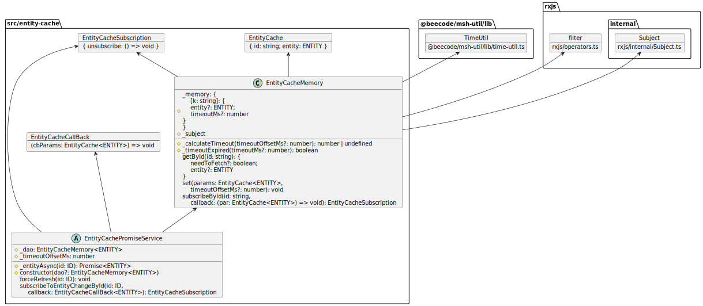

  

# msh-util

Micro-service helper: node error

This project is intended to be used in typescript project.

<!-- toc -->

- [Install](#install)
- [Diagram](#diagram)

<!-- tocstop -->

## Install

`npm i @beecode/msh-util`

## Diagram

